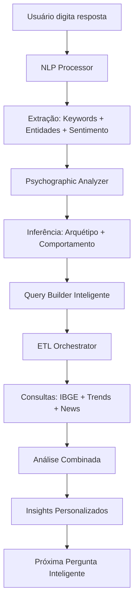

# 🤖 Plano de Implementação: Chat de Inteligência de Negócio com IA

## 📋 Resumo Executivo

Este plano detalha a implementação de um **Sistema de Chat Inteligente** que maximiza a extração de informações do usuário para gerar as análises mais precisas possíveis usando **100% da granularidade das fontes** e **toda a inteligência psicográfica** do sistema TARGET.

### 🎯 Objetivo
Transformar o chat atual em uma **ferramenta de descoberta inteligente** que, através de conversação natural com IA, extrai sistematicamente todas as informações relevantes para gerar:
- ✅ **Segmentação psicográfica ultra-precisa** (2+ bilhões de combinações)
- ✅ **Análise geográfica granular** (5.570 municípios)
- ✅ **Insights comportamentais profundos** (156 dimensões de consumo POF)
- ✅ **Predições de mercado baseadas em tendências** (87 fontes de notícias + Google Trends)

---

## 🧠 Análise da Inteligência Atual do Sistema

### **1. Módulos de Inteligência Disponíveis**

#### **📊 NLP Processor (100% Implementado)**
- **Capacidades**: Análise semântica, extração de entidades, keywords, tópicos
- **Modelos**: spaCy (pt_core_news_lg) + BERT (all-MiniLM-L6-v2)
- **Saídas**: Keywords, entidades geográficas, sentimento, embeddings
- **Uso no Chat**: Processar respostas do usuário para extrair conceitos

#### **🧠 Psychographic Analyzer (100% Implementado)**
- **Capacidades**: 5 arquétipos comportamentais, índice de sentimento, análise de gastos POF
- **Dados POF**: 104 categorias de gastos, 52 bens duráveis, dados SIDRA reais
- **Saídas**: Experiencialista, Tradicionalista, Pragmático, Aspiracional, Equilibrado
- **Uso no Chat**: Inferir perfil comportamental a partir das respostas

#### **🔄 ETL Orchestrator (90% Implementado)**
- **Capacidades**: Coordenação de múltiplas fontes, cache inteligente, análise combinada
- **Fontes**: IBGE SIDRA (8.000+ tabelas), Google Trends (100+ cidades), News (87 fontes)
- **Saídas**: Segmentos de mercado enriquecidos, métricas psicográficas
- **Uso no Chat**: Executar análises baseadas nos dados extraídos

### **2. Potencial de Granularidade Máxima**

#### **📍 Granularidade Geográfica**
```
Nacional → Regiões (5) → Estados (27) → Municípios (5.570) → Distritos (10.302)
```

#### **👥 Granularidade Demográfica**
```
18 faixas etárias × 9 níveis educação × 5 raças × 15 faixas renda × 2 sexos = 24.300 combinações
```

#### **💰 Granularidade de Consumo**
```
104 categorias POF × 52 bens duráveis × 5 arquétipos = 27.040 dimensões comportamentais
```

#### **🌍 Granularidade Temporal**
```
Dados históricos (2002-2024) + Tendências atuais + Projeções futuras
```

---

## 🎯 Metodologia de Extração Inteligente

### **Fase 1: Descoberta do Negócio (Contexto Fundamental)**

#### **🏢 Informações do Negócio**
```yaml
Categoria_Principal:
  - Pergunta: "Descreva o seu negócio em uma frase"
  - Objetivo: Extrair setor, categoria, tipo de produto/serviço
  - NLP_Processing: Keywords principais, entidades de negócio
  - Granularidade_Alvo: Tabelas IBGE específicas do setor

Estágio_Desenvolvimento:
  - Pergunta: "Seu negócio já está funcionando ou é uma ideia?"
  - Opções: [ideia, mvp, funcionando, expandindo]
  - Objetivo: Definir tipo de análise (viabilidade vs expansão)
  
Modelo_Negócio:
  - Pergunta: "Como você ganha dinheiro? (produto único, assinatura, marketplace...)"
  - Objetivo: Entender estrutura de receita
  - Impacto: Análise de ciclo de compra, frequência, LTV
```

#### **🎯 Definição do Público**
```yaml
Público_Inicial:
  - Pergunta: "Quem você imagina que seria o cliente ideal?"
  - NLP_Processing: Extrair demografia implícita, características comportamentais
  - Psychographic_Analysis: Inferir arquétipo a partir da descrição
  
Problema_Resolvido:
  - Pergunta: "Que problema específico você resolve para essas pessoas?"
  - Objetivo: Entender motivação de compra, urgência, valor percebido
  
Experiência_Atual:
  - Pergunta: "Como essas pessoas resolvem esse problema hoje?"
  - Objetivo: Mapear concorrência, identificar gaps, pontos de dor
```

### **Fase 2: Aprofundamento Psicográfico (Inteligência Comportamental)**

#### **💰 Comportamento de Consumo**
```yaml
Poder_Aquisitivo:
  - Pergunta: "Quanto você imagina que seu cliente ideal gasta por mês em [categoria relacionada]?"
  - Objetivo: Mapear para faixas de renda POF, validar com dados IBGE
  
Prioridades_Gasto:
  - Pergunta: "Se seu cliente tivesse R$1000 extras, onde ele gastaria primeiro?"
  - Opcoes: [experiências, tecnologia, casa, família, futuro, status]
  - Psychographic_Processing: Inferir arquétipo comportamental
  
Canais_Compra:
  - Pergunta: "Onde/como seu cliente prefere comprar produtos assim?"
  - Objetivo: Entender comportamento digital vs físico, influenciadores
```

#### **🏠 Estilo de Vida e Valores**
```yaml
Localização_Preferencial:
  - Pergunta: "Em que tipo de região/cidade seu cliente mora?"
  - Opcoes: [capital, interior, região_metropolitana, cidade_pequena]
  - Geographic_Processing: Mapear para códigos IBGE, definir granularidade
  
Valores_Importantes:
  - Pergunta: "O que é mais importante para seu cliente: praticidade, status, sustentabilidade, tradição ou inovação?"
  - Psychographic_Processing: Mapear para arquétipos comportamentais
  
Tecnologia_Adoção:
  - Pergunta: "Seu cliente é do tipo que compra tecnologia assim que lança ou espera ficar mais barato?"
  - Objective: Definir perfil de adoção, mapear para bens duráveis POF
```

### **Fase 3: Inteligência Geográfica e Temporal (Granularidade Máxima)**

#### **📍 Granularidade Geográfica**
```yaml
Foco_Geográfico:
  - Pergunta: "Você quer focar em alguma região específica do Brasil?"
  - Opcoes: [nacional, regiões, estados_específicos, cidades_específicas]
  - SIDRA_Processing: Definir nível de granularidade das consultas
  
Expansão_Futura:
  - Pergunta: "Em que ordem você expandiria geograficamente?"
  - Objetivo: Priorizar análises, otimizar consultas IBGE
  
Sazonalidade:
  - Pergunta: "Seu produto/serviço tem épocas do ano melhores?"
  - Google_Trends_Processing: Análise de padrões temporais
```

#### **⏰ Inteligência Temporal**
```yaml
Urgência_Mercado:
  - Pergunta: "Você precisa lançar rápido ou pode aguardar o momento ideal?"
  - Objetivo: Definir profundidade da análise de tendências
  
Horizonte_Planejamento:
  - Pergunta: "Você está pensando nos próximos 6 meses ou 2-3 anos?"
  - News_Analysis: Definir período de análise de notícias e tendências
```

### **Fase 4: Validação Inteligente (Dados vs Percepção)**

#### **🔍 Confronto com Dados Reais**
```yaml
Validação_Suposições:
  - Sistema: "Baseado no que você falou, nossa IA identificou que seu cliente ideal seria [ARQUÉTIPO] com renda em torno de [FAIXA], morando em [REGIÃO]. Isso faz sentido?"
  - Refinamento: Ajustar parâmetros baseado na validação
  
Surpresas_Descobertas:
  - Sistema: "Nossos dados mostram que [INSIGHT_INESPERADO]. Como você interpreta isso?"
  - Objetivo: Capturar insights não óbvios, validar interpretações
```

---

## 🛠️ Arquitetura Técnica do Chat Inteligente

### **1. Fluxo de Processamento**



### **2. Estrutura de Dados Extraídos**

#### **📊 BusinessProfile (Schema Principal)**
```typescript
interface BusinessProfile {
  // Dados Básicos
  business_description: string;
  business_stage: 'idea' | 'mvp' | 'operating' | 'expanding';
  revenue_model: string;
  problem_solved: string;
  
  // Perfil do Cliente
  target_audience: {
    demographic: {
      age_range: string;
      income_range: string;
      education_level: string;
      location_type: string;
      family_structure: string;
    };
    psychographic: {
      archetype: 'experiencialista' | 'tradicionalista' | 'pragmatico' | 'aspiracional' | 'equilibrado';
      spending_priorities: {
        category: string;
        priority_score: number;
      }[];
      lifestyle_indicators: {
        tech_adoption: number;
        comfort_level: number;
        mobility: boolean;
      };
      values: string[];
    };
    behavioral: {
      purchase_channels: string[];
      decision_factors: string[];
      seasonal_patterns: string[];
    };
  };
  
  // Contexto Geográfico
  geographic_focus: {
    level: 'national' | 'regional' | 'state' | 'municipal';
    specific_locations: string[];
    expansion_priority: string[];
  };
  
  // Contexto Temporal
  temporal_context: {
    urgency_level: 'immediate' | 'moderate' | 'patient';
    planning_horizon: '6_months' | '1_year' | '2_3_years';
    seasonal_relevance: boolean;
  };
  
  // Meta-informações
  confidence_scores: {
    demographic_confidence: number;
    psychographic_confidence: number;
    geographic_confidence: number;
  };
  completion_percentage: number;
  validation_status: boolean;
}
```

### **3. Componentes do Sistema**

#### **🤖 AI Chat Manager**
```typescript
class IntelligentChatManager {
  private nlpProcessor: NLPProcessor;
  private psychographicAnalyzer: PsychographicAnalyzer;
  private etlOrchestrator: ETLOrchestrator;
  private questionEngine: SmartQuestionEngine;
  
  async processUserResponse(response: string, currentProfile: Partial<BusinessProfile>): Promise<{
    updatedProfile: Partial<BusinessProfile>;
    nextQuestion: SmartQuestion;
    insights: Insight[];
    confidenceScores: ConfidenceScores;
  }>;
}
```

#### **❓ Smart Question Engine**
```typescript
interface SmartQuestion {
  id: string;
  text: string;
  type: 'open_text' | 'multiple_choice' | 'scale' | 'validation';
  options?: string[];
  context: string;
  priority: number;
  depends_on: string[];
  extraction_targets: string[];
}

class SmartQuestionEngine {
  generateNextQuestion(profile: Partial<BusinessProfile>): SmartQuestion;
  calculateCompletionScore(profile: Partial<BusinessProfile>): number;
  identifyMissingCriticalInfo(profile: Partial<BusinessProfile>): string[];
}
```

#### **💡 Real-time Insights Generator**
```typescript
interface Insight {
  type: 'demographic' | 'psychographic' | 'market_size' | 'opportunity' | 'warning' | 'trend';
  title: string;
  description: string;
  confidence: number;
  data_source: string;
  actionable: boolean;
  related_metrics: string[];
}

class RealtimeInsightsGenerator {
  generateInsights(profile: Partial<BusinessProfile>): Promise<Insight[]>;
  validateInsightAccuracy(insight: Insight, realData: any): number;
}
```

---

## 📋 Sequência Inteligente de Perguntas

### **🔄 Fluxo Adaptativo**

#### **Nível 1: Descoberta Básica (3-4 perguntas)**
1. **"Descreva seu negócio em uma frase"**
   - NLP: Extrai setor, categoria, palavras-chave principais
   - Trigger: Carrega contexto setorial específico

2. **"Quem seria seu cliente ideal?"**
   - NLP: Demografia implícita, características comportamentais
   - Psychographic: Primeiro arquétipo candidato

3. **"Onde você imagina que esse cliente mora/atua?"**
   - Geographic: Define granularidade geográfica necessária
   - IBGE: Pré-carrega tabelas regionais relevantes

4. **"Seu negócio já está funcionando ou ainda é uma ideia?"**
   - Context: Define tipo de análise (viabilidade vs crescimento)

#### **Nível 2: Aprofundamento Inteligente (5-7 perguntas)**
*Perguntas adaptam-se baseado nas respostas do Nível 1*

**Se Arquétipo = Experiencialista:**
- "Seu cliente valoriza mais experiências únicas ou conveniência no dia a dia?"
- "Ele costuma pesquisar muito antes de comprar ou decide por impulso?"

**Se Localização = Específica:**
- "Por que especificamente [cidade/região]? Que vantagem você vê lá?"
- "Você conhece bem o comportamento do consumidor dessa região?"

**Se Negócio = Funcionando:**
- "Qual feedback mais comum você recebe dos clientes atuais?"
- "Que tipo de cliente você gostaria de atrair mais?"

#### **Nível 3: Validação Inteligente (3-5 perguntas)**
*Sistema confronta suposições com dados reais*

1. **"Nossa análise sugere que seu cliente típico gasta R$[valor] por mês em [categoria]. Isso parece realista?"**
   - Objetivo: Validar inferências POF

2. **"Os dados mostram que [região] tem [insight_inesperado]. Como você interpreta isso?"**
   - Objetivo: Capturar conhecimento tácito do usuário

3. **"Você está disposto a ajustar seu foco baseado em oportunidades que encontramos?"**
   - Objetivo: Flexibilidade estratégica

---

## 🚀 Implementação Técnica

### **Fase 1: Base do Chat Inteligente (4-5 dias)**

#### **Dia 1-2: Estrutura Base**
```bash
# Arquivos a criar/modificar:
backend/shared/schemas/business_profile.py        # Schema principal
backend/api_gateway/app/services/chat_intelligence.py  # Core do chat
backend/api_gateway/app/services/question_engine.py    # Gerador de perguntas
frontend/src/components/chat/IntelligentChatInterface.tsx  # Interface melhorada
```

#### **Dia 3-4: Integração com IA Externa**
- **API Choice**: OpenAI GPT-4 ou Anthropic Claude (ambos têm tier gratuito)
- **Context Management**: Sistema de memória conversacional
- **Prompt Engineering**: Templates otimizados para extração de negócio

#### **Dia 5: Integração com NLP/Psychographic**
- Conectar com NLPProcessor existente
- Integrar com PsychographicAnalyzer
- Pipeline de processamento em tempo real

### **Fase 2: Question Engine Inteligente (3-4 dias)**

#### **Algoritmo de Próxima Pergunta**
```python
def generate_next_question(profile: BusinessProfile) -> SmartQuestion:
    # 1. Calcula completion score por categoria
    completion_scores = calculate_completion_scores(profile)
    
    # 2. Identifica categoria com menor score E maior impacto
    priority_category = get_highest_impact_lowest_completion(completion_scores)
    
    # 3. Considera dependências entre perguntas
    available_questions = filter_by_dependencies(priority_category, profile)
    
    # 4. Personaliza pergunta baseado no contexto atual
    personalized_question = personalize_question(available_questions[0], profile)
    
    return personalized_question
```

### **Fase 3: Sistema de Insights em Tempo Real (3-4 dias)**

#### **Pipeline de Insights**
```python
async def generate_realtime_insights(profile: BusinessProfile) -> List[Insight]:
    insights = []
    
    # 1. Insights demográficos (baseado em IBGE)
    if profile.target_audience.demographic.location_type:
        demographic_insights = await analyze_demographic_data(profile)
        insights.extend(demographic_insights)
    
    # 2. Insights psicográficos (baseado em POF)
    if profile.target_audience.psychographic.archetype:
        psychographic_insights = await analyze_psychographic_patterns(profile)
        insights.extend(psychographic_insights)
    
    # 3. Insights de mercado (baseado em Trends + News)
    if profile.business_description:
        market_insights = await analyze_market_trends(profile)
        insights.extend(market_insights)
    
    # 4. Oportunidades não óbvias
    opportunity_insights = await discover_hidden_opportunities(profile)
    insights.extend(opportunity_insights)
    
    return prioritize_insights(insights)
```

### **Fase 4: Interface Melhorada (2-3 dias)**

#### **Features da Interface**
- **Typing Indicators**: IA "pensando" durante processamento
- **Progress Bar**: Mostra completion do perfil de negócio
- **Insight Panels**: Cards laterais com insights em tempo real
- **Validation Checkpoints**: Confirmação de inferências importantes
- **Data Visualization**: Gráficos dos dados descobertos

---

## 📊 Métricas de Sucesso

### **🎯 Eficiência da Extração**
- **Information Completeness**: % de BusinessProfile preenchido
- **Question Efficiency**: Informações extraídas por pergunta
- **Validation Accuracy**: % de inferências confirmadas pelo usuário

### **🧠 Qualidade da Inteligência**
- **Psychographic Accuracy**: Precisão dos arquétipos inferidos
- **Geographic Relevance**: Adequação das sugestões geográficas
- **Market Insight Quality**: Relevância dos insights descobertos

### **⚡ Performance Técnica**
- **Response Time**: <3 segundos por processamento
- **API Integration**: Uptime 99%+ para IA externa
- **Cache Hit Rate**: >80% para consultas similares

---

## 🔧 Integração com APIs de IA Gratuitas

### **OpenAI GPT-4 (Opção 1)**
```yaml
Vantagens:
  - Excelente compreensão de contexto
  - API bem documentada
  - Boa performance em português
  
Limitações:
  - $20/mês após tier gratuito
  - Rate limiting agressivo
  
Uso Recomendado:
  - Processamento de respostas abertas
  - Geração de perguntas personalizadas
  - Análise de sentimento contextual
```

### **Anthropic Claude (Opção 2)**
```yaml
Vantagens:
  - Melhor para conversas longas
  - Menos alucinações
  - Boa análise de negócios
  
Limitações:
  - API mais nova, menos estável
  - Pricing similar ao OpenAI
  
Uso Recomendado:
  - Manutenção de contexto conversacional
  - Validação de insights complexos
  - Geração de recomendações estratégicas
```

### **Hugging Face Transformers (Opção 3 - Gratuita)**
```yaml
Vantagens:
  - Completamente gratuito
  - Modelos open-source
  - Controle total sobre processamento
  
Limitações:
  - Requer mais setup
  - Performance menor
  - Consumo de recursos local
  
Uso Recomendado:
  - Análise de sentimento
  - Classificação de respostas
  - Extração de entidades
```

---

## 🎯 Resultado Final Esperado

### **🎬 Experiência do Usuário**
1. **Início Natural**: Chat inicia como conversa casual sobre o negócio
2. **Descoberta Inteligente**: Cada resposta gera insights imediatos
3. **Validação Colaborativa**: Sistema confirma interpretações com o usuário
4. **Conclusão Rica**: Perfil de negócio 90%+ completo após 12-15 perguntas
5. **Análise Profunda**: Sistema gera análise usando 100% da granularidade disponível

### **📈 Output do Sistema**
```yaml
Análise Final Gerada:
  BusinessProfile: 90%+ preenchido
  Market Segments: 5-10 segmentos ultra-específicos
  Geographic Analysis: Até nível municipal se relevante
  Psychographic Insights: Arquétipo + características detalhadas
  Market Opportunities: Top 5 oportunidades rankeadas
  Strategic Recommendations: 8-12 ações priorizadas
  Data Confidence: Score de confiança para cada insight
  
Granularidade Atingida:
  Demographic: 24.300 combinações possíveis
  Geographic: 5.570 municípios
  Psychographic: 5 arquétipos × 156 dimensões
  Temporal: Histórico + Atual + Tendências
```

---

## 📋 Próximos Passos

### **Decisões Necessárias:**
1. **API de IA**: OpenAI, Anthropic ou Hugging Face?
2. **Profundidade Inicial**: Implementar todas as fases ou fazer MVP?
3. **Integração**: Modificar chat atual ou criar novo componente?
4. **Cronograma**: 10-15 dias para implementação completa?

### **Ação Imediata:**
Após aprovação, início da **Fase 1** com criação do schema `BusinessProfile` e integração básica com IA externa.

**🎯 Meta Final:** Chat que extrai 90%+ das informações necessárias através de conversação natural, maximizando o uso da inteligência psicográfica e granularidade geográfica do sistema TARGET.

---

## 📝 Considerações Técnicas Finais

### **🔐 Privacidade e Segurança**
- Dados de conversação armazenados localmente
- APIs externas recebem apenas dados processados/anonimizados
- Opt-out automático para dados sensíveis

### **⚡ Performance e Escalabilidade**
- Cache inteligente para padrões comuns de negócio
- Processamento assíncrono para não bloquear UI
- Fallbacks para quando APIs externas falham

### **🎨 UX/UI**
- Interface conversacional natural
- Feedback visual em tempo real
- Possibilidade de editar/corrigir interpretações
- Export dos insights descobertos

**Status**: ⏳ **Aguardando aprovação para iniciar implementação**
