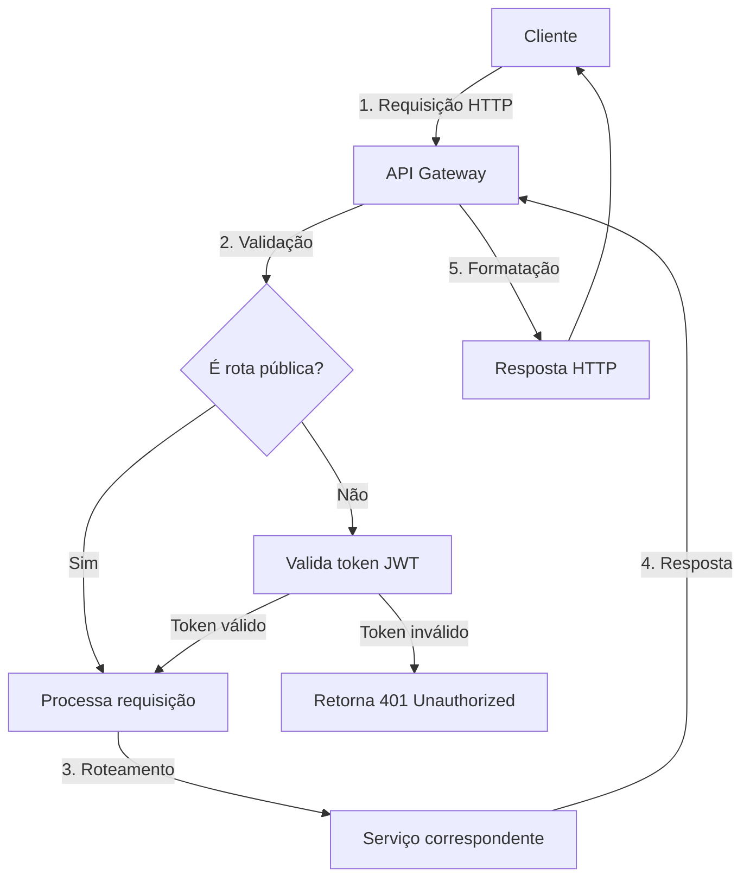

# API Gateway Module Documentation

## Visão Geral
O módulo API Gateway atua como o ponto de entrada principal para todas as requisições do sistema, gerenciando autenticação, roteamento e validação de entrada.

## Objetivos do Projeto Atendidos

### 1. Processamento Seguro da Entrada do Usuário
- **Autenticação e Autorização**
  - Implementação de JWT (JSON Web Tokens) para autenticação segura
  - Middleware para validação de tokens em rotas protegidas
  - Controle de acesso baseado em papéis (RBAC)

- **Validação de Entrada**
  - Uso de Pydantic para validação de esquemas
  - Validação de formato de e-mail e força de senha
  - Sanitização de entrada para prevenir injeção

### 2. Roteamento Inteligente
- **Estrutura de Rotas**
  - Organização modular por domínio de negócio
  - Versionamento de API (v1, v2, etc.)
  - Documentação automática via OpenAPI/Swagger

### 3. Gerenciamento de Sessão
- **Controle de Estado**
  - Tokens de acesso com tempo de vida limitado
  - Refresh tokens para renovação segura
  - Blacklist de tokens inválidos

## Componentes Principais

### 1. Autenticação (`/app/core/security.py`)
```python
# Exemplo de implementação de segurança
def create_access_token(data: dict, expires_delta: timedelta = None):
    # Implementação do JWT
    pass

def verify_password(plain_password: str, hashed_password: str) -> bool:
    # Verificação de senha
    pass
```

### 2. Rotas (`/app/routes/`)
- `auth.py`: Autenticação e gerenciamento de usuários
- `analysis.py`: Submissão e consulta de análises
- `health.py`: Verificação de saúde da API

### 3. Middleware
- Tratamento de erros global
- Logging de requisições
- Headers de segurança (CORS, CSP, etc.)

## Fluxo de Dados



## Próximos Passos
1. Implementar rate limiting
2. Adicionar documentação detalhada das rotas
3. Melhorar tratamento de erros específicos por domínio
4. Adicionar métricas de uso da API
