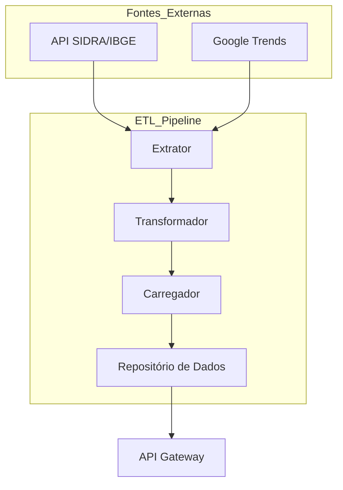
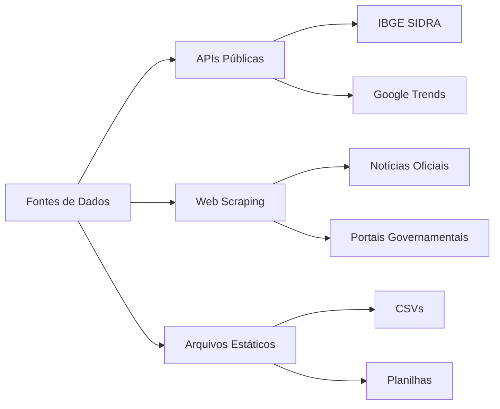
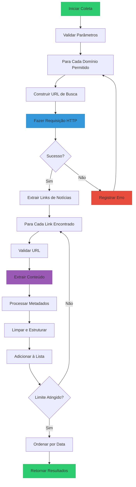
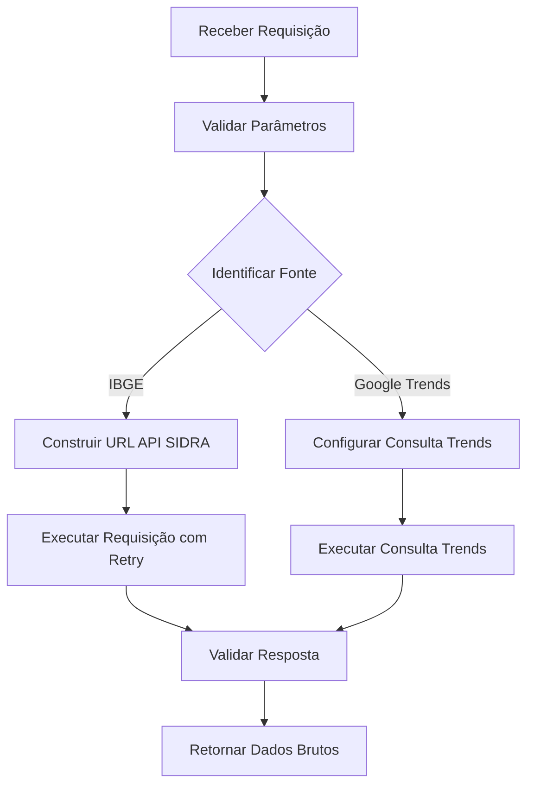
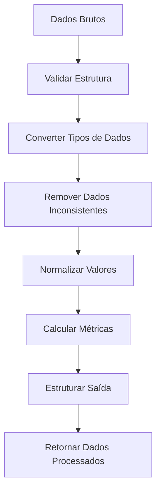
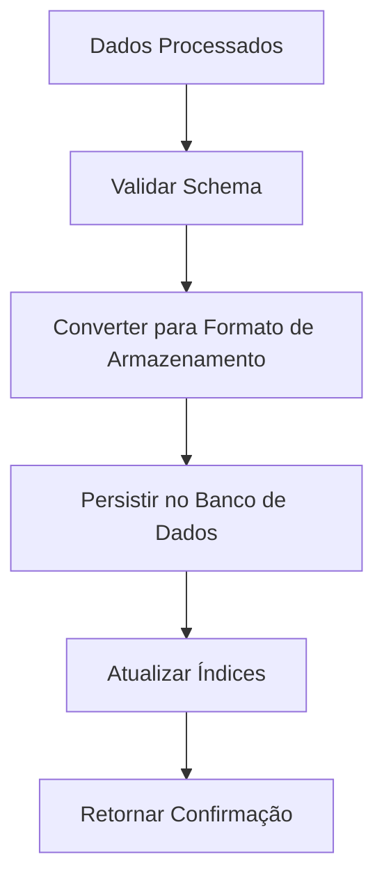

# ETL Pipeline Module Documentation

## Visão Geral
O módulo ETL (Extração, Transformação e Carga) é o coração do sistema de processamento de dados, responsável por coletar, processar e armazenar dados de fontes externas, com foco principal nos dados do IBGE e Google Trends. Este documento detalha a arquitetura, componentes e fluxos de dados do pipeline ETL.

## Arquitetura

### Diagrama de Componentes



## Objetivos do Projeto Atendidos

### 1. Coleta de Dados Públicos
- **Integração com IBGE SIDRA**
  - Acesso a dados demográficos e socioeconômicos através da API SIDRA
  - Mapeamento automático de conceitos para códigos SIDRA
  - Suporte a múltiplas tabelas de dados com cache inteligente
  - Tratamento de limites de taxa (rate limiting)
  - Retry automático em falhas de rede

- **Google Trends**
  - Análise de tendências de busca em tempo real
  - Comparação de múltiplos termos relevantes
  - Dados regionais e temporais com granularidade ajustável
  - Normalização automática de dados

### 2. Processamento Eficiente
- **Processamento Paralelo**
  - Uso de ThreadPoolExecutor para operações I/O bound
  - Gerenciamento de concorrência otimizado
  - Pipeline assíncrono para máxima eficiência

- **Cache Inteligente**
  - Cache em memória para respostas de API
  - Invalidação baseada em tempo
  - Persistência de cache entre execuções

- **Resiliência**
  - Circuit breaker para falhas em cascata
  - Backoff exponencial para retentativas
  - Fallback para dados históricos em caso de falha

### 3. Qualidade de Dados
- **Validação**
  - Verificação de dados ausentes ou inconsistentes
  - Normalização automática de formatos
  - Padronização de unidades de medida
  - Validação de esquema com Pydantic

- **Monitoramento**
  - Métricas de desempenho
  - Logs detalhados
  - Alertas para anomalias

## Componentes Principais

### 1. Cliente IBGE (`/app/services/ibge_client.py`)
```python
class SIDRAClient:
    """
    Cliente para acessar a API SIDRA do IBGE.
    
    Atributos:
        base_url (str): URL base da API SIDRA
        cache (dict): Cache em memória para respostas
        session (aiohttp.ClientSession): Sessão HTTP reutilizável
        rate_limiter (RateLimiter): Controlador de taxa de requisições
        
    Métodos Principais:
        get_table: Obtém dados de uma tabela específica
        search_tables: Busca tabelas por termo
        get_metadata: Obtém metadados de uma tabela
    """
    
    def __init__(self, cache_ttl: int = 3600):
        self.base_url = "https://apisidra.ibge.gov.br/values"
        self.cache = TTLCache(maxsize=1000, ttl=cache_ttl)
        self.session = None
        self.rate_limiter = RateLimiter(max_calls=10, period=1)  # 10 chamadas/segundo
    
    async def get_table(self, table_code: str, params: dict) -> dict:
        """
        Obtém dados de uma tabela específica da API SIDRA.
        
        Args:
            table_code (str): Código da tabela (ex: 't/6401/n1/all')
            params (dict): Parâmetros da consulta
            
        Returns:
            dict: Dados da tabela processados
            
        Raises:
            APIError: Em caso de falha na requisição
        """
        cache_key = f"{table_code}:{json.dumps(params, sort_keys=True)}"
        if cache_key in self.cache:
            return self.cache[cache_key]
            
        async with self.rate_limiter:
            try:
                async with self.session.get(
                    f"{self.base_url}/{table_code}",
                    params=params,
                    timeout=30
                ) as response:
                    response.raise_for_status()
                    data = await response.json()
                    self.cache[cache_key] = data
                    return data
                    
            except Exception as e:
                logger.error(f"Falha ao acessar tabela {table_code}: {str(e)}")
                raise APIError(f"Erro na API SIDRA: {str(e)}")
```

### 2.1 Serviço de Scraping de Notícias (`/app/services/extractors/news/news_scraper.py`)

```python
class NewsScraper:
    """
    Serviço para coleta de notícias de fontes abertas e confiáveis.
    
    Características:
    - Respeita políticas de acesso e termos de serviço
    - Implementa rate limiting e delays entre requisições
    - Extrai conteúdo estruturado de páginas de notícias
    - Suporte a múltiplas fontes de notícias oficiais
    - Tratamento robusto de erros e fallbacks
    
    Fontes suportadas:
    - Agência Brasil (EBC)
    - IBGE Notícias
    - Portal do Governo
    - Rádio Agência Brasil
    """
    
    # Domínios permitidos para scraping
    ALLOWED_DOMAINS = [
        'agenciabrasil.ebc.com.br',  # Agência Brasil (pública)
        'agenciagov.ebc.com.br',     # Agência Gov
        'www.ibge.gov.br',           # IBGE
        'agenciadenoticias.ibge.gov.br',  # Agência de Notícias do IBGE
        'www.gov.br/agenciabrasil',  # Portal do Governo
        'agenciabrasil.ebc.com.br/radioagencia',  # Rádio Agência Brasil
    ]
    
    # Padrões de URL para identificar notícias
    NEWS_URL_PATTERNS = [
        r'.*/noticias/.*',
        r'.*/ultimas-noticias/.*',
        r'.*/agencia-.+',
        r'.*/[0-9]{4}/[0-9]{2}/[0-9]{2}/.*',  # URLs com data
    ]
    
    # Seletores CSS para extração de conteúdo
    SITE_SELECTORS = {
        'agenciabrasil.ebc.com.br': {
            'title': 'h1.documentFirstHeading',
            'content': 'div.documentDescription, div.entry-content',
            'date': 'span.documentPublished > span.value',
            'author': 'span.documentAuthor > a',
            'category': 'div.documentByLine > span.documentCategory',
        },
        # ... outros seletores específicos por domínio
    }
    
    def __init__(self, user_agent: str = None, request_timeout: int = 10):
        """
        Inicializa o serviço de scraping de notícias.
        
        Args:
            user_agent: User-Agent a ser usado nas requisições
            request_timeout: Timeout em segundos para as requisições HTTP
        """
        self.session = requests.Session()
        self.user_agent = user_agent or UserAgent().chrome
        self.request_timeout = request_timeout
        self.request_delay = 2.0  # Delay entre requisições
        self.last_request_time = 0
    
    def scrape_news(self, query: str, max_results: int = 10, days_back: int = 30) -> List[NewsArticle]:
        """
        Coleta notícias relacionadas a uma consulta.
        
        Estratégia de busca:
        1. Para cada domínio permitido, busca notícias
        2. Filtra por data e relevância
        3. Ordena por data de publicação
        4. Limita ao número máximo de resultados
        
        Args:
            query: Termos de busca
            max_results: Número máximo de resultados (padrão: 10)
            days_back: Número máximo de dias para buscar (padrão: 30)
            
        Returns:
            List[NewsArticle]: Lista de artigos de notícias processados
            
        Raises:
            NewsScraperError: Em caso de falha na coleta
        """
        try:
            articles = []
            min_date = datetime.now() - timedelta(days=days_back)
            
            for domain in self.ALLOWED_DOMAINS:
                if len(articles) >= max_results:
                    break
                    
                domain_articles = self._search_domain_news(
                    base_url=f"https://{domain}",
                    query=query,
                    max_results=max_results - len(articles),
                    min_date=min_date
                )
                articles.extend(domain_articles)
            
            # Ordena por data (mais recentes primeiro)
            articles.sort(key=lambda x: x.published_at, reverse=True)
            return articles[:max_results]
            
        except Exception as e:
            logger.error(f"Erro ao buscar notícias: {str(e)}", exc_info=True)
            raise NewsScraperError(f"Falha ao buscar notícias: {str(e)}")
    
    def _make_request(self, url: str) -> Optional[BeautifulSoup]:
        """
        Faz uma requisição HTTP com tratamento de erros e rate limiting.
        
        Implementa:
        - Rate limiting com delay entre requisições
        - Tratamento de timeouts
        - Verificação de status HTTP
        - Parse do conteúdo HTML
        
        Args:
            url: URL para fazer a requisição
            
        Returns:
            BeautifulSoup: Objeto com o conteúdo parseado ou None em caso de erro
        """
        self._respect_delay()
        
        try:
            response = self.session.get(
                url,
                timeout=self.request_timeout,
                headers={'User-Agent': self.user_agent}
            )
            response.raise_for_status()
            return BeautifulSoup(response.text, 'html.parser')
            
        except requests.RequestException as e:
            logger.warning(f"Erro ao acessar {url}: {str(e)}")
            return None
```

### 2.2 Mapeador SIDRA (`/app/services/sidra_mapper.py`)
```python
class SIDRAMapper:
    """
    Mapeia conceitos e localizações para parâmetros da API SIDRA.
    
    Funcionalidades:
        - Tradução de termos de busca para códigos SIDRA
        - Mapeamento de localizações para códigos territoriais
        - Gerenciamento de versões de tabelas
        - Validação de parâmetros
    """
    
    CONCEPT_MAP = {
        "renda": {
            "tabela": "t/4714",
            "variaveis": ["V1657", "V1661", "V1663"]
        },
        "educacao": {
            "tabela": "t/5918",
            "variaveis": ["V1004", "V1006"]
        }
        # ... outros mapeamentos
    }
    
    def map_concept(self, concept: str) -> dict:
        """Mapeia um conceito para parâmetros da API SIDRA."""
        return self.CONCEPT_MAP.get(concept.lower(), {})
    
    def map_location(self, location: str) -> str:
        """Mapeia um local para código territorial."""
        # Implementação do mapeamento
        pass
```

### 2.3 Serviço de Transformação de Notícias (`/app/services/transformers/news_transformer.py`)

O serviço de transformação de notícias é responsável por processar o conteúdo bruto coletado pelo `NewsScraper` e extrair insights estruturados usando técnicas de Processamento de Linguagem Natural (PLN) e aprendizado de máquina.

```python
class NewsTransformer:
    """
    Transforma notícias brutas em insights estruturados usando PLN.
    
    Funcionalidades principais:
    - Processamento de texto (limpeza, normalização, lematização)
    - Extração de palavras-chave e tópicos
    - Análise de sentimento
    - Reconhecimento de entidades nomeadas
    - Agrupamento de notícias relacionadas
    - Geração de métricas de mercado
    """
    
    def __init__(self, nlp_model: str = 'pt_core_news_lg'):
        """
        Inicializa o transformador com o modelo de linguagem especificado.
        
        Args:
            nlp_model: Nome do modelo spaCy a ser carregado
                     (padrão: 'pt_core_news_lg' para português)
        """
        self.nlp_model_name = nlp_model
        self.nlp = None  # Modelo spaCy
        self.vectorizer = None  # Vetorizador TF-IDF
        self.lda = None  # Modelo LDA para tópicos
        
        # Configurações
        self.max_keywords = 10
        self.num_topics = 5
        self.topic_words = 5
        self.cluster_size = 5
        
        self._load_models()
```

#### 2.3.1 Fluxo de Processamento

O método principal `transform` orquestra o processamento completo:

```python
def transform(self, articles: List[NewsArticle]) -> Dict[str, Any]:
    """
    Processa uma lista de artigos de notícias.
    
    Args:
        articles: Lista de artigos de notícias para processar
        
    Returns:
        Dicionário com os resultados do processamento:
        - articles: Artigos processados com metadados enriquecidos
        - topics: Tópicos identificados nas notícias
        - clusters: Grupos de notícias relacionadas
        - sentiment: Análise de sentimento agregada
        - entities: Entidades nomeadas mais frequentes
        - market_metrics: Métricas de mercado derivadas
    """
    # 1. Processa cada artigo individualmente
    processed_articles = [self._process_article(article) for article in articles]
    
    # 2. Análise de tópicos
    topics = self._extract_topics([a.content for a in processed_articles])
    
    # 3. Agrupamento de notícias relacionadas
    clusters = self._cluster_articles(processed_articles)
    
    # 4. Extrai entidades nomeadas
    entities = self._extract_common_entities(processed_articles)
    
    # 5. Análise de sentimento agregada
    sentiment = self._aggregate_sentiment(processed_articles)
    
    # 6. Gera métricas de mercado
    market_metrics = self._generate_market_metrics(processed_articles, topics, sentiment)
    
    return {
        'articles': processed_articles,
        'topics': topics,
        'clusters': clusters,
        'sentiment': sentiment,
        'entities': entities,
        'market_metrics': market_metrics
    }
```

#### 2.3.2 Componentes Principais

1. **Processamento de Artigo Individual**
   - Extrai resumo (primeiras 3 frases)
   - Identifica entidades nomeadas (pessoas, organizações, locais)
   - Calcula pontuação de sentimento
   - Extrai palavras-chave
   - Gera metadados (contagem de palavras, frases, etc.)

2. **Análise de Tópicos**
   - Usa Latent Dirichlet Allocation (LDA)
   - Identifica tópicos principais nas notícias
   - Extrai palavras-chave representativas de cada tópico

3. **Agrupamento de Notícias**
   - Agrupa notícias semanticamente relacionadas
   - Usa vetorização TF-IDF e K-means
   - Permite análise de cobertura de tópicos ao longo do tempo

4. **Análise de Sentimento**
   - Classifica o sentimento como positivo, neutro ou negativo
   - Calcula pontuação agregada para conjuntos de notícias
   - Identifica tendências de sentimento ao longo do tempo

5. **Geração de Métricas**
   - Volume de notícias por tópico
   - Sentimento médio por segmento de mercado
   - Frequência de menção a entidades (empresas, produtos, etc.)
   - Correlação entre notícias e métricas de mercado

#### 2.3.3 Integração com o Pipeline ETL

O `NewsTransformer` é utilizado pelo `ETLCoordinator` para processar notícias coletadas:

```python
class ETLCoordinator:
    # ...
    
    async def _extract_news(self, queries: List[str]) -> List[Dict]:
        """
        Extrai notícias baseadas nas consultas fornecidas.
        
        Args:
            queries: Lista de termos de busca
            
        Returns:
            Lista de notícias processadas
        """
        news_scraper = NewsScraper()
        transformer = NewsTransformer()
        
        all_articles = []
        for query in queries:
            # Coleta notícias brutas
            articles = news_scraper.scrape_news(
                query=query,
                max_results=50,
                days_back=7
            )
            
            # Processa as notícias
            if articles:
                processed = transformer.transform(articles)
                all_articles.extend(processed['articles'])
        
        return all_articles
```

#### 2.3.4 Tratamento de Erros

O serviço implementa várias estratégias de resiliência:

1. **Tratamento de Exceções**
   - Captura e registra erros de processamento
   - Continua o processamento mesmo com falhas parciais
   - Mantém rastreamento de erros para análise posterior

2. **Fallbacks**
   - Usa valores padrão quando a análise falha
   - Mantém processamento mínimo mesmo com falhas em componentes avançados
   - Fornece mensagens de erro descritivas

3. **Monitoramento**
   - Registra métricas de desempenho
   - Rastreia taxas de sucesso/falha
   - Monitora o uso de recursos
    - Geração automática de resumos
    - Normalização de dados
    - Enriquecimento com metadados adicionais
    """
    
    def __init__(self, nlp_pipeline=None):
        """
        Inicializa o transformador de notícias.
        
        Args:
            nlp_pipeline: Pipeline de NLP pré-treinado (opcional)
        """
        self.nlp = nlp_pipeline or self._load_default_nlp()
    
    def transform_articles(self, articles: List[NewsArticle]) -> List[ProcessedNews]:
        """
        Processa uma lista de artigos de notícias.
        
        Fluxo de processamento:
        1. Limpeza e normalização do texto
        2. Extração de metadados
        3. Análise de sentimento
        4. Extração de entidades
        5. Geração de resumo
        6. Categorização
        
        Args:
            articles: Lista de artigos brutos
            
        Returns:
            List[ProcessedNews]: Lista de notícias processadas
            
        Raises:
            NewsProcessingError: Em caso de falha no processamento
        """
        processed_articles = []
        
        for article in articles:
            try:
                # Aplica o pipeline de NLP
                doc = self.nlp(article.content)
                
                # Extrai entidades nomeadas
                entities = self._extract_entities(doc)
                
                # Analisa o sentimento
                sentiment = self._analyze_sentiment(doc)
                
                # Gera resumo
                summary = self._generate_summary(article.content)
                
                # Categoriza o conteúdo
                categories = self._categorize_content(doc, article.metadata)
                
                # Cria o objeto processado
                processed = ProcessedNews(
                    title=article.title,
                    content=article.content,
                    url=article.url,
                    published_at=article.published_at,
                    source=article.source,
                    entities=entities,
                    sentiment=sentiment,
                    summary=summary,
                    categories=categories,
                    metadata={
                        'word_count': len(article.content.split()),
                        'processed_at': datetime.utcnow(),
                        'language': 'pt-BR'
                    }
                )
                
                processed_articles.append(processed)
                
            except Exception as e:
                logger.error(f"Erro ao processar artigo {article.url}: {str(e)}")
                continue
                
        return processed_articles
    
    def _extract_entities(self, doc) -> Dict[str, List[str]]:
        """Extrai entidades nomeadas do texto."""
        entities = {'PERSON': [], 'ORG': [], 'LOC': [], 'MISC': []}
        for ent in doc.ents:
            if ent.label_ in entities:
                entities[ent.label_].append(ent.text)
        return entities
    
    def _analyze_sentiment(self, doc) -> Dict[str, float]:
        """Analisa o sentimento do texto."""
        # Implementação simplificada
        positive = sum(1 for token in doc if token.sentiment > 0)
        negative = sum(1 for token in doc if token.sentiment < 0)
        total = len(doc)
        
        return {
            'positive': positive / total if total else 0,
            'negative': negative / total if total else 0,
            'neutral': 1 - (positive + negative) / total if total else 1
        }
```

### 3. Processador de Dados (`/app/processors/data_processor.py`)
```python
class DataProcessor:
    """
    Processa e transforma dados brutos em informações estruturadas.
    
    Métodos Principais:
        clean_data: Remove dados inconsistentes
        normalize: Normaliza valores numéricos
        aggregate: Agrega dados por dimensões
        generate_insights: Extrai insights dos dados
    """
    
    @staticmethod
    def clean_data(df: pd.DataFrame) -> pd.DataFrame:
        """
        Limpa os dados brutos.
        
        Args:
            df: DataFrame com dados brutos
            
        Returns:
            DataFrame limpo e padronizado
        """
        # Implementação da limpeza
        pass
        
    def generate_insights(self, data: dict) -> dict:
        """
        Gera insights a partir dos dados processados.
        
        Args:
            data: Dados processados
            
        Returns:
            dict: Insights estruturados
        """
        insights = {}
        # Implementação da geração de insights
        return insights
```

### 4. Gerenciador de Pipeline (`/app/pipeline/manager.py`)
```python
class PipelineManager:
    """
    Gerencia a execução do pipeline ETL.
    
    Responsabilidades:
        - Orquestração das etapas ETL
        - Gerenciamento de estado
        - Tratamento de erros
        - Logging e métricas
    """
    
    async def run_pipeline(self, query: dict) -> dict:
        """Executa o pipeline completo para uma consulta."""
        try:
            # 1. Extração
            raw_data = await self.extract_data(query)
            
            # 2. Transformação
            processed_data = await self.transform_data(raw_data)
            
            # 3. Carga
            result = await self.load_data(processed_data)
            
            return {"status": "success", "data": result}
            
        except Exception as e:
            logger.error(f"Erro no pipeline: {str(e)}")
            return {"status": "error", "message": str(e)}
```

## Fluxo de Dados Detalhado

### 1. Extração

#### 1.1 Fontes de Dados



#### 1.2 Fluxo Detalhado de Scraping de Notícias



### 1.3 Estratégias de Tratamento de Erros no Scraping

1. **Tratamento de Timeout**
   ```python
   try:
       response = session.get(url, timeout=10)
   except requests.Timeout:
       logger.warning(f"Timeout ao acessar {url}")
       return None
   ```

2. **Retry com Backoff**
   ```python
   from tenacity import retry, stop_after_attempt, wait_exponential
   
   @retry(
       stop=stop_after_attempt(3),
       wait=wait_exponential(multiplier=1, min=4, max=10),
       retry=retry_if_exception_type((requests.RequestException,))
   )
   def fetch_url(url):
       return session.get(url)
   ```

3. **Validação de Conteúdo**
   ```python
   def is_valid_article(soup):
       # Verifica se a página contém elementos essenciais
       title = soup.find('h1')
       content = soup.find('article') or soup.find('div', class_='content')
       return bool(title and content and len(content.text) > 500)
   ```

4. **Rotação de User-Agent**
   ```python
   from fake_useragent import UserAgent
   
   def get_random_user_agent():
       ua = UserAgent()
       return ua.random
   ```

5. **Gerenciamento de Sessão**
   ```python
   def create_session():
       session = requests.Session()
       session.headers.update({
           'User-Agent': get_random_user_agent(),
           'Accept-Language': 'pt-BR,pt;q=0.9,en-US;q=0.8,en;q=0.7',
           'Accept': 'text/html,application/xhtml+xml,application/xml;q=0.9,*/*;q=0.8'
       })
       return session
   ```


### 2. Transformação


### 3. Carga


## Fontes de Dados

### Tabelas IBGE Principais

| Tabela | Descrição | Variáveis Principais | Uso no Projeto |
|--------|-----------|----------------------|----------------|
| 6401   | PNAD Contínua | V4039, V4048, V4076 | Dados socioeconômicos atuais, emprego e renda |
| 7482   | Despesas Cultura | V9001, V8000, V8000_DESC | Análise de hábitos de consumo e lazer |
| 7493   | Posse de Bens | V9001, V9005, V9006 | Nível socioeconômico e acesso a tecnologia |
| 7501   | Condições de Vida | V9001, V1300, V1301 | Qualidade de vida e necessidades básicas |
| 5918   | Educação | V1004, V1006, V1028 | Nível educacional e acesso à educação |
| 4714   | Rendimento | V1657, V1661, V1663 | Distribuição de renda familiar |

### Fontes de Notícias

| Fonte | Domínio | Tipo de Conteúdo | Frequência de Atualização |
|-------|---------|------------------|---------------------------|
| Agência Brasil | agenciabrasil.ebc.com.br | Notícias oficiais | Diária |
| IBGE Notícias | agenciadenoticias.ibge.gov.br | Dados e pesquisas | Semanal |
| Portal Gov | www.gov.br/agenciabrasil | Notícias oficiais | Diária |
| Rádio Agência | agenciabrasil.ebc.com.br/radioagencia | Notícias em áudio | Diária |

### Estratégias de Coleta

1. **APIs Públicas**
   - Uso de clientes oficiais quando disponíveis
   - Rate limiting e cache apropriados
   - Tratamento de erros e retentativas

2. **Web Scraping**
   - Respeito aos termos de serviço
   - Identificação clara do user-agent
   - Delays entre requisições
   - Rotação de IPs quando necessário
   - Fallback para versões em cache

| Tabela | Descrição | Variáveis Principais | Uso no Projeto |
|--------|-----------|----------------------|----------------|
| 6401   | PNAD Contínua | V4039, V4048, V4076 | Dados socioeconômicos atuais, emprego e renda |
| 7482   | Despesas Cultura | V9001, V8000, V8000_DESC | Análise de hábitos de consumo e lazer |
| 7493   | Posse de Bens | V9001, V9005, V9006 | Nível socioeconômico e acesso a tecnologia |
| 7501   | Condições de Vida | V9001, V1300, V1301 | Qualidade de vida e necessidades básicas |
| 5918   | Educação | V1004, V1006, V1028 | Nível educacional e acesso à educação |
| 4714   | Rendimento | V1657, V1661, V1663 | Distribuição de renda familiar |

## Estratégias de Tratamento de Erros

1. **Retry com Backoff Exponencial**
   ```python
   @retry(
       stop=stop_after_attempt(3),
       wait=wait_exponential(multiplier=1, min=4, max=10),
       retry=retry_if_exception_type((IOError, TimeoutError, TooManyRequests))
   )
   async def fetch_data(self, url):
       # Implementação da requisição
   ```

2. **Circuit Breaker**
   ```python
   from circuitbreaker import circuit
   
   @circuit(failure_threshold=5, recovery_timeout=60)
   async def call_external_service(self):
       # Chamada ao serviço externo
   ```

3. **Fallback para Dados Históricos**
   ```python
   async def get_data_with_fallback(self, query):
       try:
           return await self.get_fresh_data(query)
       except Exception as e:
           logger.warning(f"Falha ao obter dados atualizados: {e}")
           return await self.get_historical_data(query)
   ```

## Monitoramento e Métricas

### Métricas Principais
- Taxa de sucesso/falha das requisições
- Tempo médio de resposta por fonte
- Tamanho dos dados processados
- Uso de memória e CPU

### Logs Estruturados
```json
{
  "timestamp": "2025-01-15T14:30:00Z",
  "level": "INFO",
  "service": "etl_pipeline",
  "operation": "process_data",
  "duration_ms": 2450,
  "status": "success",
  "data_source": "IBGE_SIDRA",
  "table_id": "6401",
  "records_processed": 1500
}
```

## Próximos Passos

### Melhorias Planejadas
1. **Cache Distribuído**
   - Implementar Redis para cache distribuído
   - Invalidação baseada em eventos
   
2. **Novas Fontes de Dados**
   - Dados do Banco Central
   - Dados do Ministério da Saúde
   - Dados climáticos do INMET
   
3. **Otimizações de Desempenho**
   - Processamento em lote (batch processing)
   - Particionamento de dados
   - Processamento distribuído com Dask ou Ray

4. **Monitoramento Avançado**
   - Dashboard em tempo real
   - Alertas proativos
   - Análise de tendências

5. **Segurança**
   - Criptografia em trânsito e em repouso
   - Controle de acesso baseado em funções (RBAC)
   - Auditoria de acesso

## Considerações de Implantação

### Requisitos do Sistema
- Python 3.9+
- aiohttp para requisições assíncronas
- Redis para cache
- Banco de dados compatível com SQLAlchemy

### Variáveis de Ambiente
```env
# Configurações do Redis
REDIS_HOST=localhost
REDIS_PORT=6379
REDIS_DB=0

# Configurações da API SIDRA
SIDRA_BASE_URL=https://apisidra.ibge.gov.br/values
SIDRA_RATE_LIMIT=10  # requisições/segundo

# Configurações do Google Trends
TRENDS_GEO=BR
TRENDS_TIMEFRAME='today 12-m'

# Níveis de Log
LOG_LEVEL=INFO
LOG_FORMAT=json
```

### Orquestração com Docker
```yaml
version: '3.8'

services:
  etl_pipeline:
    build: .
    environment:
      - REDIS_HOST=redis
      - LOG_LEVEL=INFO
    depends_on:
      - redis
    deploy:
      resources:
        limits:
          cpus: '2'
          memory: 2G

  redis:
    image: redis:alpine
    ports:
      - "6379:6379"
    volumes:
      - redis_data:/data

volumes:
  redis_data:
```
