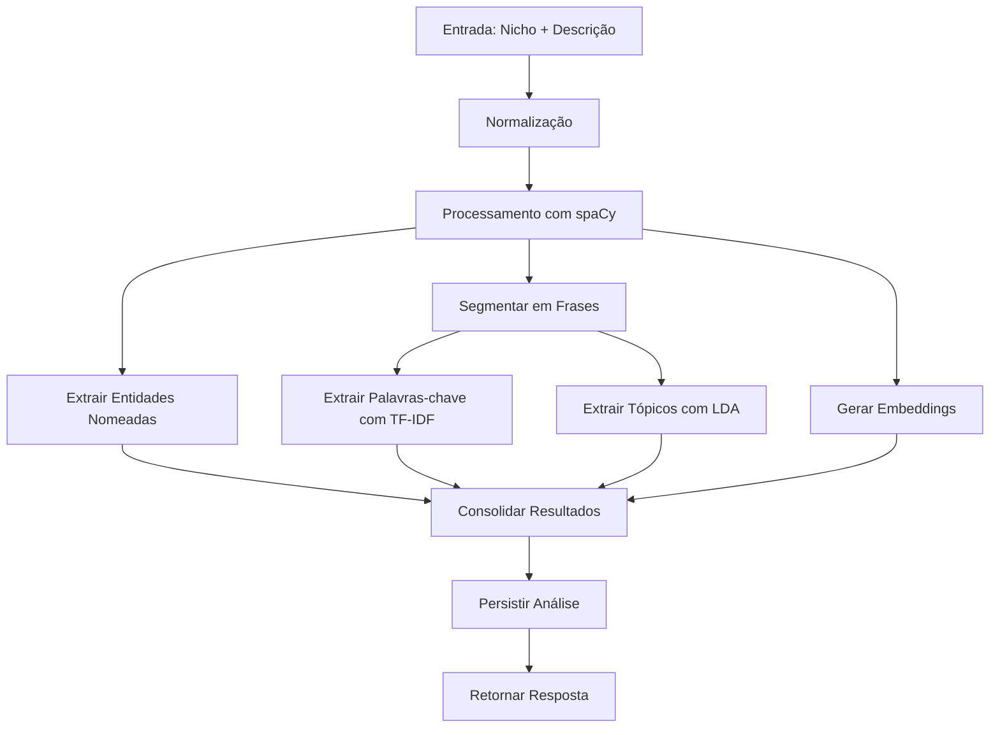

# NLP Processor Module Documentation

## Visão Geral
O módulo de Processamento de Linguagem Natural (PLN) é responsável por analisar e extrair informações relevantes do texto fornecido pelos usuários, transformando descrições de nicho e produto em características estruturadas para análise. O módulo utiliza técnicas avançadas de PLN para processamento de texto em português, com foco em eficiência e precisão.

## Arquitetura do Módulo

```
nlp_processor/
├── app/
│   ├── api/               # Endpoints da API
│   ├── services/          # Lógica de negócios
│   │   ├── nlp_service.py       # Serviço principal de PLN
│   │   ├── analysis_service.py  # Serviço de análise
│   │   └── market_analysis_service.py  # Análise de mercado
│   └── main.py            # Aplicação FastAPI principal
├── tests/                 # Testes unitários e de integração
├── requirements.txt       # Dependências do projeto
└── Dockerfile            # Configuração de container
```

## Objetivos do Projeto Atendidos

### 1. Análise Semântica Avançada
- **Extração de Características**
  - Identificação de entidades nomeadas (pessoas, organizações, locais, datas, valores)
  - Extração de palavras-chave relevantes usando TF-IDF
  - Análise de tópicos latentes com LDA (Latent Dirichlet Allocation)
  - Geração de embeddings semânticos com dois modelos:
    - `all-MiniLM-L6-v2` (384 dimensões) - quando disponível
    - spaCy (`pt_core_news_lg`) - como fallback
  - Normalização de texto (remoção de acentos, caracteres especiais, etc.)
  - Suporte a n-gramas (1-2 palavras) para melhor captura de conceitos compostos

### 2. Integração com Fontes de Dados
- **Mapeamento para Parâmetros de Busca**
  - Tradução de conceitos para termos pesquisáveis
  - Identificação de características demográficas
  - Extração de localizações geográficas
  - Processamento de texto para compatibilidade com APIs de dados do IBGE
  - Normalização de termos para padronização nas buscas

### 3. Privacidade por Design
- **Processamento Local**
  - Modelos executados localmente
  - Sem envio de dados para serviços externos
  - Minimização de dados processados
  - Cache de modelos para melhor desempenho
  - Tratamento de erros robusto com fallbacks

### 4. Desempenho e Escalabilidade
- Processamento assíncrono de requisições
- Cache de embeddings para consultas repetidas
- Otimização de memória com carregamento lazy de modelos
- Suporte a processamento em lote para operações em massa

## Componentes Principais

### 1. Serviço de NLP (`/app/services/nlp_service.py`)
O coração do processamento de linguagem natural, responsável por:
- Normalização de texto
- Extração de palavras-chave com TF-IDF
- Modelagem de tópicos com LDA
- Reconhecimento de entidades nomeadas
- Geração de embeddings

**Principais funções:**
- `extract_features(niche: str, description: str)`: Processa o nicho e a descrição
- `extract_keywords_tfidf()`: Extrai palavras-chave usando TF-IDF
- `extract_topics_lda()`: Extrai tópicos usando LDA
- `normalize_text()`: Normaliza o texto (minúsculas, sem acentos, etc.)

### 2. Serviço de Análise (`/app/services/analysis_service.py`)
Gerencia o fluxo de análise completo:
- Orquestra o processamento de texto
- Gerencia a persistência dos resultados
- Fornece interface para a API

**Principais funções:**
- `create_and_extract_features()`: Processa e armazena uma análise
- `_normalize_text()`: Normalização básica de texto

## Fluxo de Processamento

### 1. Entrada de Dados
- Recebe texto de nicho e descrição do usuário
- Valida os dados de entrada
- Prepara para processamento

### 2. Pré-processamento
- Normalização de texto:
  - Conversão para minúsculas
  - Remoção de acentos
  - Remoção de caracteres especiais
  - Normalização de espaços

### 3. Processamento Principal
1. **Análise com spaCy**
   - Tokenização
   - Lematização
   - Identificação de entidades nomeadas
   - Extração de frases

2. **Extração de Palavras-chave**
   - Aplicação de TF-IDF
   - Cálculo de relevância
   - Filtragem de stopwords
   - Seleção das melhores palavras-chave

3. **Modelagem de Tópicos**
   - Aplicação de LDA
   - Identificação de tópicos principais
   - Extração de palavras-chave por tópico
   - Cálculo de similaridade

4. **Geração de Embeddings**
   - Geração de vetores com BERT (quando disponível)
   - Fallback para embeddings do spaCy
   - Cálculo de similaridade entre tópicos

## Modelos e Técnicas

### 1. Modelo de Linguagem (spaCy)
- **Nome**: pt_core_news_lg
- **Descrição**: Modelo grande do spaCy para português
- **Uso**: Processamento linguístico básico, NER, lematização
- **Licença**: MIT

### 2. Modelo de Embeddings (Sentence-Transformers)
- **Nome**: all-MiniLM-L6-v2
- **Dimensões**: 384
- **Idioma**: Multilíngue (incluindo Português)
- **Uso**: Similaridade semântica, agrupamento
- **Licença**: Apache-2.0
- **Notas**: Usado quando disponível, com fallback para spaCy

### 3. Técnicas de Processamento
- **TF-IDF**: Para extração de palavras-chave
- **LDA**: Para modelagem de tópicos
- **NER**: Para reconhecimento de entidades nomeadas
- **Word Vectors**: Para similaridade semântica

## Fluxo de Dados



## Estrutura de Saída

A saída do processamento segue um formato padronizado que inclui:

```json
{
  "normalized_text": "texto normalizado",
  "keywords": [
    {"keyword": "palavra1", "score": 0.95},
    {"keyword": "palavra2", "score": 0.88}
  ],
  "topics": [
    {
      "topic_id": 0,
      "keywords": ["tema1", "tema2"],
      "scores": [0.95, 0.85],
      "similarity_to_main_text": 0.92
    }
  ],
  "entities": [
    {"text": "São Paulo", "label": "LOC", "start": 10, "end": 19}
  ],
  "embeddings": {
    "bert": [0.12, -0.34, ...],
    "spacy": [0.45, -0.23, ...],
    "dimension_bert": 384,
    "dimension_spacy": 300
  },
  "metadata": {
    "language": "portuguese",
    "model": "pt_core_news_lg + all-MiniLM-L6-v2",
    "processing_steps": ["normalization", "tfidf", "lda", "ner", "spacy_embedding", "bert_embedding"]
  }
}
```

## Tratamento de Erros

O módulo implementa várias estratégias para lidar com erros:

1. **Modelos não encontrados**
   - Tenta baixar automaticamente modelos ausentes
   - Fornece mensagens de erro claras
   - Implementa fallbacks quando possível

2. **Processamento de texto**
   - Lida com textos vazios ou inválidos
   - Normaliza diferentes formatos de entrada
   - Gerencia erros de codificação

3. **Performance**
   - Timeouts para operações demoradas
   - Limitação de tamanho de texto
   - Monitoramento de uso de recursos

## Próximos Passos

1. **Melhorias de Desempenho**
   - Implementar cache de resultados
   - Otimizar processamento em lote
   - Paralelizar operações intensivas

2. **Novos Recursos**
   - Suporte a mais idiomas
   - Análise de sentimento
   - Extração de relações entre entidades
   - Classificação de texto

3. **Melhorias de Precisão**
   - Fine-tuning dos modelos para o domínio
   - Adição de dicionários específicos
   - Melhor tratamento de gírias e expressões coloquiais

4. **Monitoramento e Logging**
   - Métricas de desempenho
   - Logs detalhados para depuração
   - Alertas para problemas comuns

## Considerações de Segurança

1. **Privacidade**
   - Nenhum dado é enviado para serviços externos
   - Processamento totalmente local
   - Dados sensíveis são tratados com cuidado

2. **Desempenho**
   - Otimizado para processamento eficiente
   - Uso moderado de recursos
   - Escalável para grandes volumes

3. **Manutenção**
   - Código documentado e testado
   - Estrutura modular para fácil manutenção
   - Dependências gerenciadas e atualizadas


