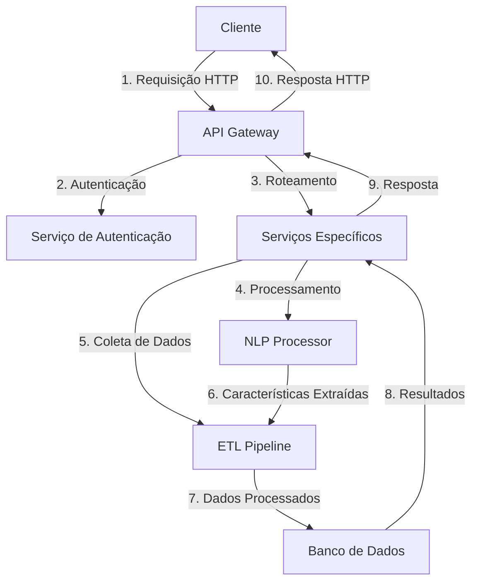

# Integração do Sistema

## Visão Arquitetural

O sistema segue uma arquitetura baseada em microsserviços com os seguintes componentes principais:



## Fluxo de Dados Principal

### 1. Submissão de Nova Análise

1. **Cliente para API Gateway**
   - Envia descrição do nicho e produto
   - Token JWT para autenticação
   ```http
   POST /api/v1/analyses
   Authorization: Bearer <token>
   
   {
     "niche": "Tecnologia Educacional",
     "description": "Plataforma de ensino de programação para crianças de 8 a 12 anos"
   }
   ```

2. **API Gateway**
   - Valida autenticação
   - Roteia para o serviço de análise
   - Retorna ID da análise criada
   ```json
   {
     "analysis_id": "123e4567-e89b-12d3-a456-426614174000",
     "status": "processing",
     "status_url": "/api/v1/analyses/123e4567-e89b-12d3-a456-426614174000"
   }
   ```

3. **Processamento Assíncrono**
   - **NLP Processor** extrai características
     - Palavras-chave: ["programação", "crianças", "educação"]
     - Entidades: ["8-12 anos"]
     - Tópicos: ["educação", "tecnologia"]
   
   - **ETL Pipeline** coleta dados
     - IBGE: Dados demográficos para crianças 8-12 anos
     - Google Trends: Popularidade de termos relacionados
     - Dados complementares de fontes abertas

4. **Armazenamento**
   - Resultados salvos no banco de dados
   - Status atualizado para "completed"

## Comunicação entre Serviços

### 1. Síncrona (HTTP/REST)
- Autenticação/autorização
- Consultas simples
- Operações críticas de tempo real

### 2. Assíncrona (Message Queue)
- Processamento de análises
- Atualizações em lote
- Tarefas demoradas

## Padrões de Resposta

### Sucesso (200 OK)
```json
{
  "status": "success",
  "data": {
    "id": "123e4567-e89b-12d3-a456-426614174000",
    "status": "completed",
    "results": {
      "demographics": {},
      "interests": [],
      "behavior": {}
    }
  }
}
```

### Processando (202 Accepted)
```json
{
  "status": "processing",
  "data": {
    "id": "123e4567-e89b-12d3-a456-426614174000",
    "status": "processing",
    "progress": 45,
    "estimated_completion": "2025-08-01T15:30:00Z"
  }
}
```

### Erro (4xx/5xx)
```json
{
  "status": "error",
  "error": {
    "code": "invalid_input",
    "message": "O campo 'description' é obrigatório",
    "details": {
      "field": "description",
      "type": "missing_field"
    }
  }
}
```

## Segurança

### 1. Autenticação
- JWT com tempo de vida limitado
- Refresh tokens
- Revogação de tokens

### 2. Autorização
- RBAC (Role-Based Access Control)
- Escopos de permissão
- Validação de propriedade

### 3. Proteção de Dados
- Criptografia em trânsito (HTTPS)
- Criptografia em repouso
- Mascaramento de dados sensíveis

## Monitoramento e Logs

### 1. Métricas
- Tempo de resposta
- Taxa de erros
- Uso de recursos

### 2. Logs Estruturados
```json
{
  "timestamp": "2025-07-31T20:30:45Z",
  "level": "INFO",
  "service": "api-gateway",
  "endpoint": "POST /api/v1/analyses",
  "duration_ms": 125,
  "request_id": "req_123456789",
  "user_id": "usr_987654321",
  "ip": "192.168.1.1"
}
```

## Escalabilidade

### 1. Horizontal
- Balanceamento de carga
- Auto-scaling
- Cache distribuído

### 2. Vertical
- Otimização de consultas
- Indexação adequada
- Particionamento de dados

## Próximos Passos
1. Implementar fila de mensagens para processamento assíncrono
2. Adicionar suporte a webhooks para notificações em tempo real
3. Melhorar estratégias de cache
4. Implementar circuit breakers para resiliência
5. Adicionar mais métricas de negócio
